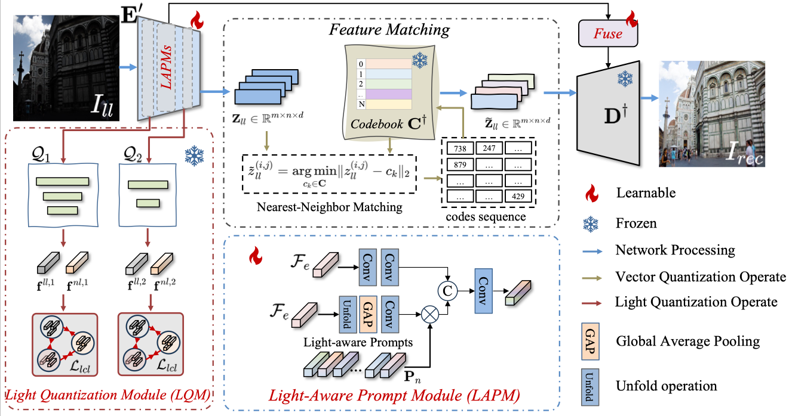
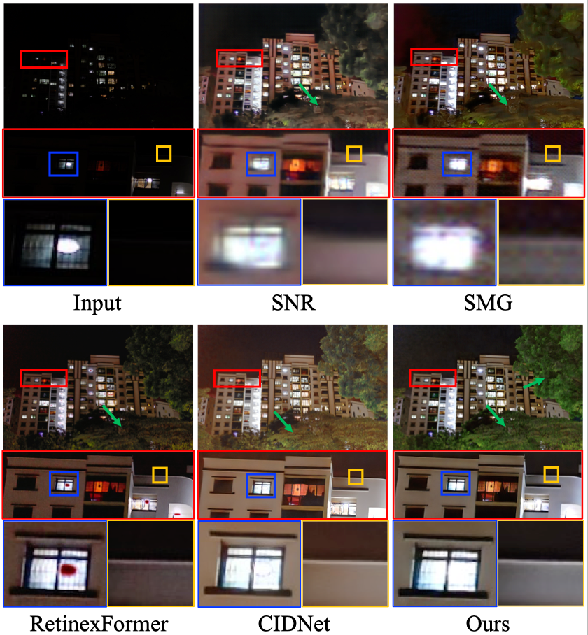
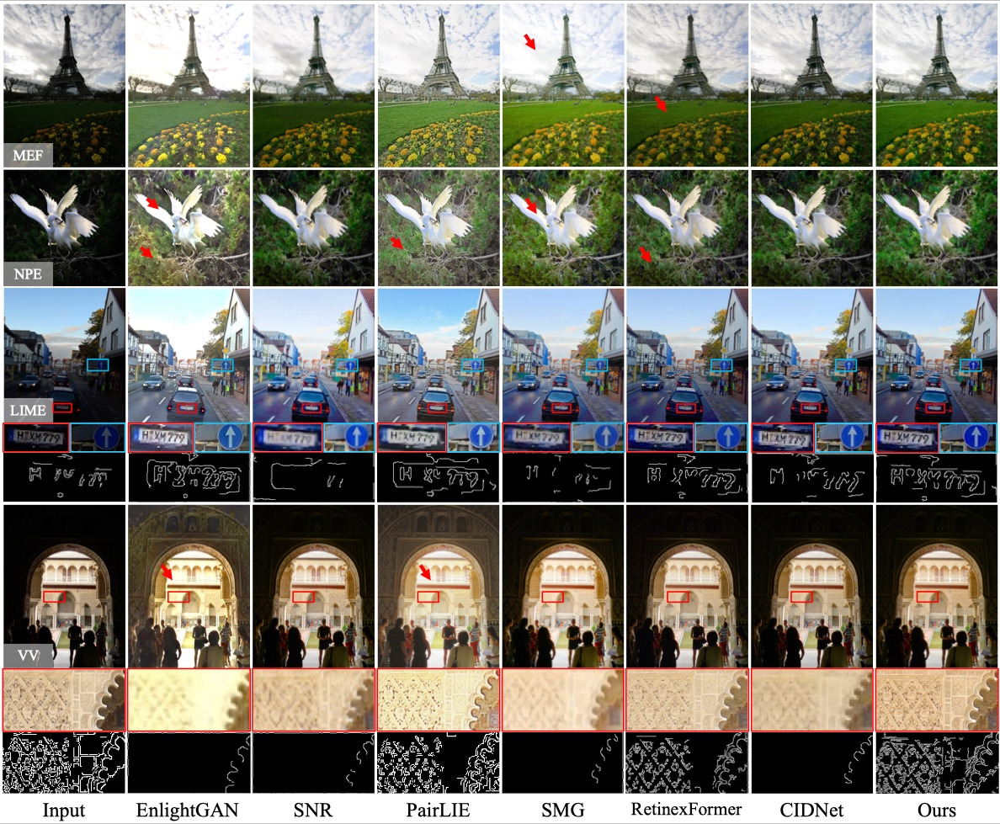

# LightQANet

This is the official PyTorch codes for the paper: [LightQANet: Quantized and Adaptive Feature  Learning for Low-Light Image Enhancement](https://ieeexplore.ieee.org/abstract/document/11417255)

>This paper has been accepted to the IEEE Transactions on Multimedia (TMM) 2026.



## Abstract:
Low-light image enhancement (LLIE) aims to improve illumination while preserving high-quality color and texture. However, existing methods often fail to extract reliable feature representations due to severely degraded pixel-level information under low-light conditions, resulting in poor texture restoration, color inconsistency, and artifact.
To address these challenges, we propose LightQANet, a novel framework that introduces quantized and adaptive feature learning for low-light enhancement, aiming to achieve consistent and robust image quality across diverse lighting conditions.
From the static modeling perspective, we design a Light Quantization Module (LQM) to explicitly extract and quantify illumination-related factors from image features. By enforcing structured light factor learning, LQM enhances the extraction of light-invariant representations and mitigates feature inconsistency across varying illumination levels.
From the dynamic adaptation perspective, we introduce a Light-Aware Prompt Module (LAPM), which encodes illumination priors into learnable prompts to dynamically guide the feature learning process. LAPM enables the model to flexibly adapt to complex and continuously changing lighting conditions, further improving image enhancement.
Extensive experiments on multiple low-light datasets demonstrate that our method achieves state-of-the-art performance, delivering superior qualitative and quantitative results across various challenging lighting scenarios.

## Experiments:
All results can be available at https://drive.google.com/drive/folders/1-h2UO3PfYoRkm4Qf5Dund3g_nEhyKffS?usp=drive_link
### Real Workd


### Unpaired


## Dependencies and Installation

- CUDA >= 11.0
- Other required packages in `codeenhance.yaml`

## Citation
```
@article{wu2025codebook,
  title={A codebook-driven approach for low-light image enhancement},
  author={Wu, Xu and Lai, Zhihui and Hou, Xianxu and Zhou, Jie and Zhang, Ya-nan and Shen, Linlin},
  journal={IEEE Transactions on Multimedia},
  year={2026},
  doi={10.1109/TMM.2026.3668540}
  publisher={Elsevier}
}
```
## License
Licensed under a [Creative Commons Attribution-NonCommercial 4.0 International](https://creativecommons.org/licenses/by-nc/4.0/) for Non-commercial use only.
Any commercial use should get formal permission first.

## Acknowledgement
This repository is maintained by [Xu Wu](https://csxuwu.github.io/).
